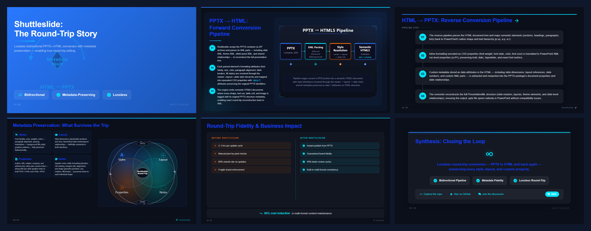
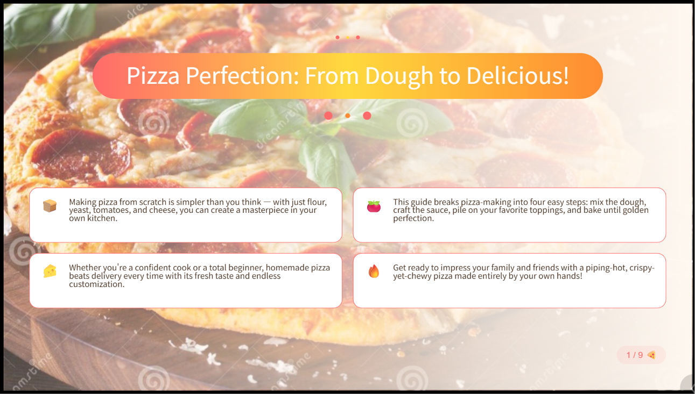
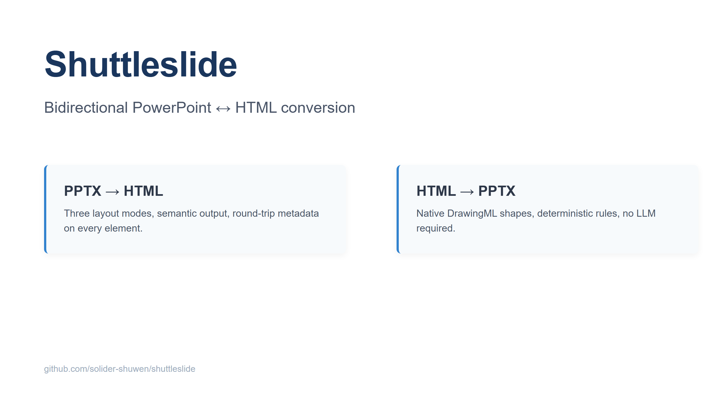
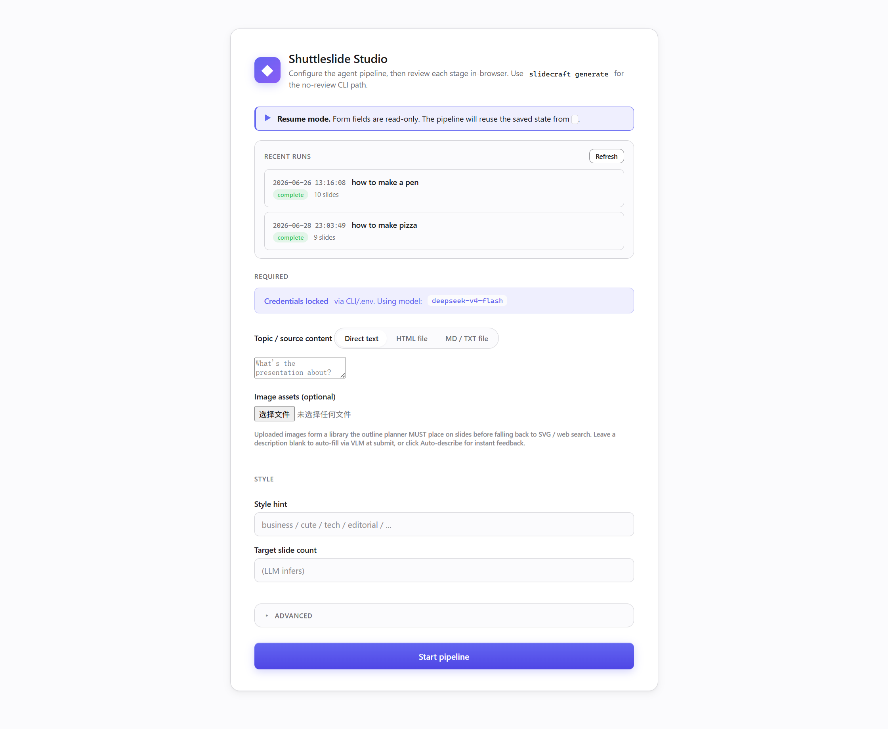
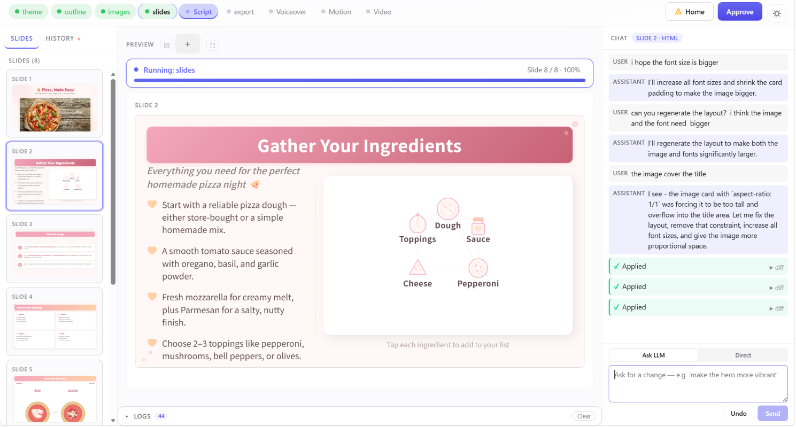
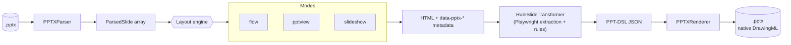
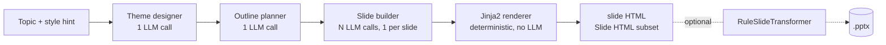

# Shuttleslide

[](https://pypi.org/project/shuttleslide/)
[](https://pypi.org/project/shuttleslide/)
[](https://opensource.org/licenses/MIT)
[](https://github.com/solider-shuwen/shuttleslide)

**Bidirectional PowerPoint ↔ HTML conversion with round-trip format preservation — plus an optional AI slide-generation pipeline.**

Shuttleslide is a Python library and CLI that turns `.pptx` files into semantic, navigable HTML and back. Unlike one-way converters that flatten slides into images or fixed templates, Shuttleslide emits real, editable elements on both sides of the round trip — text boxes, tables, native DrawingML shapes, gradients — and threads `data-pptx-*` metadata through every conversion so your formatting survives the return journey.

---

## Table of contents

- [What is Shuttleslide?](#what-is-shuttleslide)
- [Why Shuttleslide?](#why-shuttleslide)
- [How it compares](#how-it-compares)
- [Installation](#installation)
- [Quick start](#quick-start)
- [Examples](#examples)
- [Python API](#python-api)
- [CLI reference](#cli-reference)
- [Architecture](#architecture)
- [Design philosophy: CLI-first, skill-ready](#design-philosophy-cli-first-skill-ready)
- [Roadmap](#roadmap)
- [Contributing](#contributing)
- [Acknowledgments](#acknowledgments)
- [License](#license)

---

## What is Shuttleslide?

Three capabilities, one package, each independently usable:

### 1. PPTX → HTML (`slidecraft to-html`)

Convert any `.pptx` into a single self-contained HTML file. Choose between three layout modes:

- **`flow`** — semantic, scrollable page. Best for RAG / web publishing / SEO.
- **`pptview`** — PowerPoint-style editor layout. Best for design fidelity.
- **`slideshow`** (default) — interactive presentation with keyboard navigation, slide transitions, and entrance animations.

Text formatting, tables, images, shapes, gradients, bullets, and master-theme styling are all preserved.

### 2. HTML → PPTX (`slidecraft to-pptx`)

Convert HTML back into a `.pptx` with **native DrawingML shapes** — every element remains directly clickable and editable in PowerPoint. No LLM required: a deterministic rule-based pipeline (Playwright layout extraction → PPT-DSL JSON → python-pptx) handles the work.

The HTML subset Shuttleslide accepts on this side is intentionally limited to a "Slide HTML" vocabulary — see [docs/round-trip.md](docs/round-trip.md) for what's supported.

### 3. AI slide generation (`slidecraft generate`, `slidecraft review`)

Skip the source file entirely — give the agent a topic and it produces a multi-slide deck via an OpenAI-compatible LLM (Zhipu GLM, DeepSeek, OpenAI, vLLM, Ollama, …). `review` opens a web UI where each pipeline stage pauses for human approval.

> Requires the `[ai]` (and `[review]` for the web UI) install extras. See [Installation](#installation).

---

## Why Shuttleslide?

- **Round-trip preservation is the goal, not a side effect.** `data-pptx-*` attributes are emitted on PPTX → HTML and consumed on HTML → PPTX, so a deck that goes out and comes back keeps its coordinates, fonts, and structure. This is the differentiator — no other open-source tool does both directions.
- **Native DrawingML, not flattened images.** HTML → PPTX produces real PowerPoint shapes (text boxes, paths, gradients), built on a vendored copy of [ppt-master](https://github.com/hugohe3/ppt-master)'s `svg_to_pptx` engine. The result remains natively editable in PowerPoint.
- **Deterministic when you want it, AI when you don't.** The `to-html` / `to-pptx` pipeline is rule-based — no network, no LLM, no flakiness. `generate` is the optional AI path for when you don't have a source deck at all.
- **PPT-aware typography.** Line-height, paragraph spacing, and font-shrink-on-overflow are calibrated against real PowerPoint rendering (see [docs/round-trip.md](docs/round-trip.md) for the empirical ratios). HTML output looks like the original, not like a CSS approximation of the original.
- **Three layout modes** cover three different use cases — RAG ingestion, design-faithful preview, and live presentation — from one parser.
- **Extension points.** Four [entry-point groups](#cli-reference) let external packages add CLI commands, pipeline stages, or substitute prompts without touching this repo.

---

## How it compares

| Capability | Shuttleslide | [ppt-master](https://github.com/hugohe3/ppt-master) | [pptx-to-html5](https://github.com/shafe123/pptx-to-html5) | [python-pptx](https://github.com/scanny/python-pptx) | [Aspose.Slides](https://products.aspose.com/slides/python-family/) | [LibreOffice](https://www.libreoffice.org/) |
|---|:---:|:---:|:---:|:---:|:---:|:---:|
| PPTX → HTML | ✅ 3 layouts | ❌ | ✅ | ❌ | ✅ | ✅ |
| HTML → PPTX | ✅ | ✅ (AI-driven) | ❌ | ❌ | ❌ | ❌ |
| Round-trip metadata | ✅ | ❌ | ❌ | ❌ | ❌ | ❌ |
| Native DrawingML output | ✅ | ✅ | ❌ | ⚠️ manual | ✅ | ✅ |
| Works without LLM | ✅ | ❌ | ✅ | ✅ | ✅ | ✅ |
| Open source & free | ✅ MIT | ✅ MIT | ✅ | ✅ MIT | ❌ commercial | ✅ |
| Install via pip | ✅ | ❌ git clone | ✅ | ✅ | ✅ | ❌ system pkg |

**Shuttleslide vs ppt-master** — the two projects are complementary, not competing. ppt-master is an AI workflow *skill* that runs inside Claude Code / Cursor / Copilot CLI: you chat with the agent and it generates a deck from source documents. Shuttleslide is a *Python library + CLI* you call from code or shell. Shuttleslide vendors ppt-master's SVG → DrawingML converter under `src/shuttleslide/_vendored/svg_to_pptx/` (MIT-licensed, with attribution) — see [ACKNOWLEDGMENTS](#acknowledgments).

A detailed breakdown of trade-offs is in [docs/comparison.md](docs/comparison.md).

---

## Installation

```bash
# Core: PPTX ↔ HTML conversion (to-html, to-pptx, analyze)
pip install shuttleslide

# Add AI slide generation (generate command)
pip install shuttleslide[ai]

# Add the web review UI (review command)
pip install shuttleslide[review]

# Everything
pip install shuttleslide[all]
```

**One-time setup** for Playwright's headless Chromium (used by HTML → PPTX layout extraction and PPTX → HTML text-fit measurement):

```bash
python -m playwright install chromium
```

> **Python 3.9+** is required. Python 3.8 has reached end-of-life and is not supported.

### From source (development)

```bash
git clone https://github.com/solider-shuwen/shuttleslide.git
cd shuttleslide
pip install -e ".[dev]"
python -m playwright install chromium
```

---

## Quick start

### A. PPTX → HTML

```bash
# Interactive slideshow (default)
slidecraft to-html deck.pptx -o presentation.html

# Scrollable single page
slidecraft to-html deck.pptx -o presentation.html --layout flow

# Editor-style preview
slidecraft to-html deck.pptx -o presentation.html --layout pptview
```

### B. HTML → PPTX

`to-pptx` is a deterministic rule-based pipeline — no LLM, runs locally. It works best on HTML that conforms to Shuttleslide's "Slide HTML" subset, which is exactly what `generate` produces. **The recommended round-trip path is `generate` → `to-pptx`:**

```bash
# 1. Generate a deck whose HTML matches the Slide HTML subset
slidecraft generate "Quarterly business review" \
    --style business -o tmp/qbr/

# 2. Convert each generated slide to a native PPTX
slidecraft to-pptx tmp/qbr/1.html -o tmp/qbr/1.pptx
```

The resulting `.pptx` is fully editable in PowerPoint — every text box, shape, gradient, and SVG-converted path is a native DrawingML element, not a flat image.

You can also feed hand-written or third-party HTML to `to-pptx`, but fidelity depends on how closely the markup follows the [Slide HTML subset](docs/round-trip.md). Arbitrary web pages are explicitly out of scope (see [CLAUDE.md — iron rules](CLAUDE.md)).

```bash
# Arbitrary "Slide HTML" subset HTML → PPTX (best-effort)
slidecraft to-pptx slides.html -o output.pptx
```

### C. AI generation (optional)

```bash
slidecraft generate "Introduction to Machine Learning" \
    --api-base https://open.bigmodel.cn/api/paas/v4 \
    --api-key $SHUTTLESLIDE_API_KEY \
    --model glm-4.7 \
    -o tmp/gen/
```

Or launch the web review UI for human-in-the-loop generation:

```bash
pip install shuttleslide[review]
slidecraft review
```

---

## Examples

The [example/](example/) directory contains reproducible end-to-end samples. Each subdirectory has its own README describing the input, the exact command used, and where the output lands.

### `example/ai-generated/` — "How Shuttleslide Works"

A 6-slide deck about Shuttleslide itself, generated end-to-end by `slidecraft generate` against an OpenAI-compatible LLM.

<a href="example/ai-generated/"></a>

```bash
slidecraft generate "How Shuttleslide Works: The Round-Trip Story" \
    --style tech --slides 6 -o example/ai-generated/
```

### `example/pptx-to-html/` — PPTX → HTML

A real-world PPTX (with bullets, multi-level paragraphs, and SVG/shape assets) converted to an interactive slideshow HTML.

<a href="example/pptx-to-html/"></a>

```bash
slidecraft to-html example/pptx-to-html/1.pptx
```

### `example/html-to-pptx/` — HTML → PPTX

A hand-written Slide-HTML converted to a native, editable PPTX.

<a href="example/html-to-pptx/"></a>

```bash
slidecraft to-pptx example/html-to-pptx/sample.html
```

---

## Web Review UI — human-in-the-loop generation

`slidecraft generate` runs the full pipeline end-to-end without intervention. `slidecraft review` runs the **same pipeline but pauses after every stage** so you can inspect the snapshot, request changes, and only approve when you're happy. The agent won't proceed until you say go — or until you edit the snapshot yourself.

This is the workflow to reach for when the deck matters: brand reviews, stakeholder approvals, decks that have to land on someone's calendar next Monday. You stay in the loop on every stage of theme design, outline, slide content, and rendering.

### Starting a run

```bash
pip install shuttleslide[review]
slidecraft review
```

The config screen lets you set topic, style, target slide count, and (if not locked via `.env` or CLI flags) LLM credentials. Mock mode (`--mock`) runs the whole UI against canned state — useful for demos and screenshots without an LLM endpoint.

<a href="docs/images/review-config.png"></a>

### Stage-by-stage review

Once you click **Start**, the pipeline runs stage by stage. Each stage emits a snapshot you can review:

- **Theme designer** — color palette, gradients, typography pairing
- **Outline planner** — slide-by-slide structure and headlines
- **Slide builder** — element-level content per slide (text, SVG, image, table)
- **Renderer** — final HTML output

<a href="docs/images/review-stage.png"></a>

For every stage you have three options:

| Action | What happens |
|---|---|
| **Approve** | The pipeline advances to the next stage using the current snapshot as-is. |
| **Edit manually** | Open the snapshot in an in-browser editor and change values directly — tweak copy, swap colors, fix an outline item. Your edits become the new truth the next stage reads from. |
| **Ask the LLM** | Describe what you want changed in natural language ("drop the third slide", "make the title punchier", "use a cooler palette") and the agent regenerates the affected parts of the snapshot. The LLM only sees the current snapshot plus your instruction, not the full conversation. |

Both edit paths produce a new snapshot that you re-review — so you can iterate manually for some changes and let the LLM handle others, in any order, on the same stage.

### Resuming

Review runs are persisted under `tmp/web_review/<timestamp>/`. If you close the browser or kill the server mid-run, restarting `slidecraft review` offers to resume from the last approved stage. Nothing is lost.

---

## Python API

All three capabilities are also exposed as importable Python APIs.

### PPTX → HTML

```python
from shuttleslide.pptx_to_html import PPTXParser, FlowLayout

parser = PPTXParser("deck.pptx")
slides = parser.parse()
html = FlowLayout().convert(slides)

Path("out.html").write_text(html, encoding="utf-8")
```

### HTML → PPTX

```python
import asyncio
from shuttleslide.html_to_pptx import RuleSlideTransformer, PPTXRenderer

async def convert(html_path: str, pptx_path: str):
    html = Path(html_path).read_text(encoding="utf-8")
    transformer = RuleSlideTransformer()
    dsl = await transformer.transform_html(html, base_dir=Path(html_path).parent)
    PPTXRenderer(base_dir=Path(html_path).parent).render(dsl, pptx_path)

asyncio.run(convert("slides.html", "out.pptx"))
```

### AI generation

```python
from shuttleslide.agent import generate_slides

await generate_slides(
    topic="Introduction to Machine Learning",
    style_hint="business",
    output_dir="tmp/gen/",
)
```

Full API reference: [docs/python-api.md](docs/python-api.md).

---

## CLI reference

| Command | Purpose |
|---|---|
| `slidecraft to-html` | PPTX → HTML (flow / pptview / slideshow) |
| `slidecraft to-pptx` | HTML → PPTX (deterministic, no LLM) |
| `slidecraft json-to-pptx` | PPT-DSL JSON → PPTX directly |
| `slidecraft analyze` | Inspect PPTX structure |
| `slidecraft generate` | AI: topic → multi-slide HTML deck |
| `slidecraft review` | AI: launch the human-in-the-loop web UI |
| `slidecraft warm-cache` | Pre-download CDN assets for offline generation |
| `slidecraft info` | Print version and project info |

Complete options, environment variables, and examples: [docs/cli-reference.md](docs/cli-reference.md).

---

## Architecture

### Round-trip pipeline (PPTX ↔ HTML)



PPTX → HTML writes `data-pptx-*` attributes on every converted element. HTML → PPTX can read those attributes to restore the original layout precisely. The whole loop is bidirectional and lossless at the semantic level.

### AI generation pipeline (topic → slides)



`slidecraft generate` runs the four stages end-to-end. `slidecraft review` runs the same stages but pauses after each one for human review (see [Web Review UI](#web-review-ui--human-in-the-loop-generation)).

More detail: [docs/round-trip.md](docs/round-trip.md) and [docs/comparison.md](docs/comparison.md).

---

## Design philosophy: CLI-first, skill-ready

Every Shuttleslide capability is a standalone `slidecraft` subcommand. This isn't an accident.

The CLI is the contract. Each command has a single, well-defined job — `to-html` converts a file, `analyze` inspects one, `generate` runs the AI agent — and produces deterministic outputs you can pipe, chain, or script. That means Shuttleslide isn't just a Python library: it's an **AI-agent-ready toolkit**. Any agent harness (Claude Code, Cursor, Copilot CLI, Cline, Aider, …) can read `slidecraft --help` and start orchestrating presentation workflows without learning a Python API.

The roadmap makes this explicit — a future Phase 4 ships an official Skill package (`SKILL.md` + `marketplace.json`) so Shuttleslide can be installed directly into AI IDEs the same way other workflow tools are.

---

## Roadmap

- **Phase 1 — PPTX → HTML** ✅ *shipped*
  - Text, tables, images, shapes, gradients, master-theme styling
  - Three layout modes (flow / pptview / slideshow)
  - CLI, Python API, deterministic (no LLM)
- **Phase 2 — HTML → PPTX** ✅ *shipped*
  - Slide-HTML subset, rule-based extraction, vendored SVG → DrawingML
  - Native, editable PowerPoint output
- **Phase 3 — Round-trip closure** 🚧 *in progress*
  - `data-pptx-*` metadata fully round-trips for all element types
  - Format-integrity verification tooling
- **Phase 4 — Skill package** 📋 *planned*
  - `SKILL.md` + marketplace manifest for AI-IDE installation

---

## Contributing

Contributions are welcome. To set up a dev environment:

```bash
git clone https://github.com/solider-shuwen/shuttleslide.git
cd shuttleslide
pip install -e ".[dev]"
python -m playwright install chromium
pytest
```

Please open an [issue](https://github.com/solider-shuwen/shuttleslide/issues) first for significant changes, so we can align on scope before you spend time on a PR.

---

## Acknowledgments

Shuttleslide builds on outstanding prior work:

- **[ppt-master](https://github.com/hugohe3/ppt-master)** by [Hugo He](https://www.hehugo.com/) — the SVG → native DrawingML conversion engine (`src/shuttleslide/_vendored/svg_to_pptx/`) is a vendored, MIT-licensed copy of his work. Without it, the HTML → PPTX direction wouldn't be possible at this quality.
- **[python-pptx](https://github.com/scanny/python-pptx)** — the foundation for reading and writing `.pptx` files.
- **[Click](https://click.palletsprojects.com/)** — CLI framework.
- **[Playwright](https://playwright.dev/python/)** — headless browser automation for layout extraction and text measurement.

---

## License

[MIT](LICENSE) © Shuttleslide Contributors
